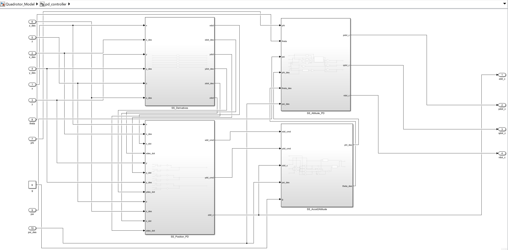
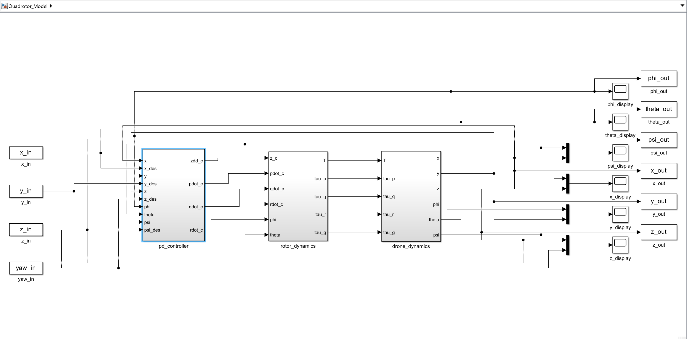
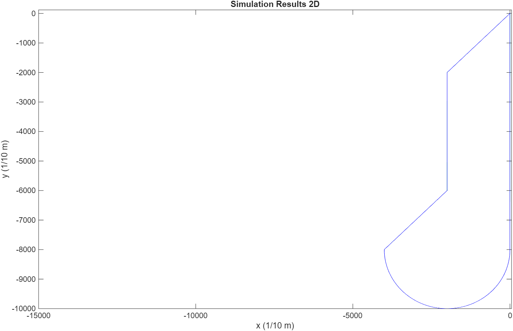
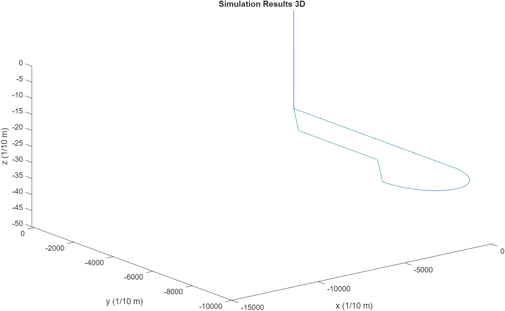

# Quadrotor Simulink Path Tracking

This repository contains a MATLAB/Simulink quadrotor simulation project for multirotor dynamics, PID-based control, and mission path tracking.

## Overview
The project implements a quadrotor simulation in Simulink and uses MATLAB scripts to generate the reference mission, set controller gains and physical parameters, run the simulation, and visualize the results.

The simulated mission includes:
- takeoff to the target altitude,
- straight-line flight to the first post,
- semicircular flight to the second post,
- zigzag return to the base,
- landing at the base.

This project was developed for a university UAV course project focused on multirotor modeling, control, and mission execution.

## Files
- `Quadrotor_Model.slx` — main Simulink model
- `project_launch.m` — main entry script
- `plan_path.m` — reference mission path generation
- `compute_sim_in.m` — converts the planned path into Simulink time-series inputs
- `attitude_compdyn.m` — attitude kinematics helper
- `plot_path_2d.m` — 2D trajectory visualization
- `plot_path_3d.m` — 3D trajectory visualization
- `Result/` — screenshots and trajectory plots

## How to Run
1. Open this folder in MATLAB.
2. Make sure all `.m` files and `Quadrotor_Model.slx` are in the same working directory.
3. Run the following command in the MATLAB command window:

```matlab
project_launch
```

The script will:
- generate the mission path,
- prepare the simulation inputs,
- set controller gains and vehicle parameters,
- run the Simulink model,
- display the 2D and 3D trajectory plots.

## Results
Example outputs from the simulation are shown below.

### Controller Structure


### Simulink Model


### 2D Path Tracking


### 3D Path Tracking


## Notes
- This repository contains the project-specific simulation model and MATLAB scripts only.
- Auto-generated or temporary files such as `.asv`, `.slxc`, and system files are not included.
- If the variable `g` is missing in the Simulink model after clearing the workspace, define it again in MATLAB before running:

```matlab
g = 9.81;
```

## Repository Structure
```text
Quadrotor-Simulink-path-tracking/
├─ Result/
│  ├─ Controller.png
│  ├─ Model.png
│  ├─ path_2D.png
│  └─ path_3D.png
├─ Quadrotor_Model.slx
├─ README.md
├─ attitude_compdyn.m
├─ compute_sim_in.m
├─ plan_path.m
├─ plot_path_2d.m
├─ plot_path_3d.m
└─ project_launch.m
```

## Future Improvements
Possible future extensions include:
- improving controller tuning for better tracking accuracy,
- adding more detailed state and control plots,
- exporting results automatically from MATLAB,
- extending the mission profile with more aggressive maneuvers or disturbances.
